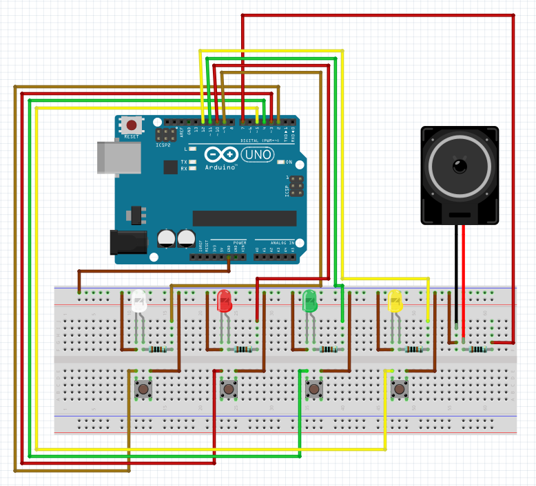
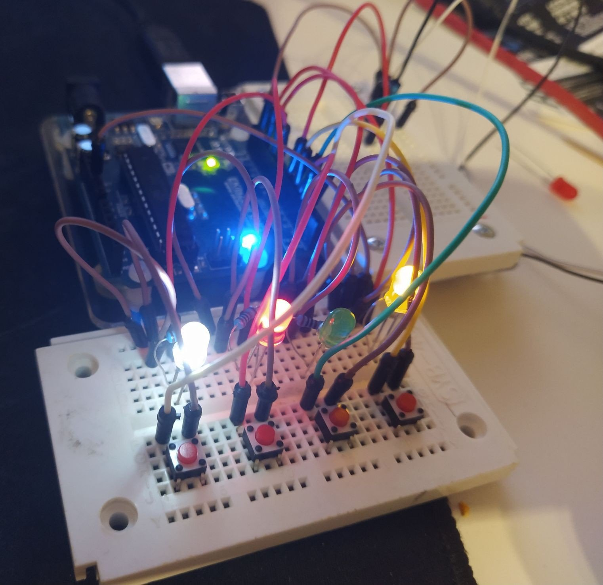

# CrackTheCode

In this simple Arduino setup, the goal is to crack the secret code; crack it.
The rules are simple:
- The code is 4 digits long, and the digits are the numbers 1 to 4 (included). Each digit is only present once.
- The buttons (and corresponding LEDs) are representing the numbers 1 to 4, from left to right.
- Each time you guess a correct digit, it is "locked in" and the LED stays on.
- Each time you guess an incorrect digit, the progress is reset and a new random 4 digit code is generated.
- Upon completion, you will hear the victory sound.

Note: Chances to get this game right, is about 4.2%: (1/4) * (1/3) * (1/2)

## Schematics

## Photo

## Demo video
[Download Here](CrackTheCode_demo.mp4?raw=true)
